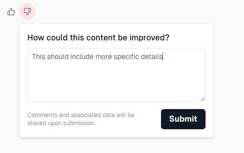
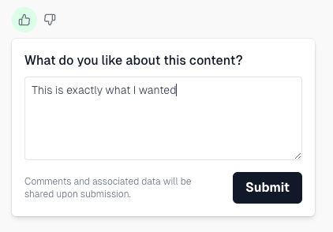

# melodi-sdk-react

A small sdk for adding Melodi's feedback react component to your app. The feedback widget adds thumbs up/thumbs down buttons anywhere in your app and a popover to record comments from your users. You can view responses in the Feedback Inbox in your Melodi account.




# Getting started

> [!NOTE]
> This library has `react` and `react-dom` (both v18.2 or higher) as peer dependencies.

## To add the melodi widget to your react app, follow these simple steps:

1. Install the library
   `npm install @melodi-fyi/melodi-sdk-react`

2. Get a publishable API key from your Melodi Account.

   - Log into your Melodi account and go to [settings](https://app.melodi.fyi/admin/settings).
   - Click "Create publishable api key"
   - Copy the newly created key

3. Add the MelodiAuthProvider with your api key

```
<MelodiAuthProvider apiKey="YOUR_API_KEY_HERE">
  {children}
</MelodiAuthProvider>
```

4. Add the MelodiFeedbackWidget and pass along the relevant info

```
<MelodiFeedbackWidget
  sample={{
    input: userSubmittedText,
    output: aiGeneratedText,
  }}
  userInfo={
    id: user.id,
    email: user.email
  }
/>
```

5. See feedback as it comes into your [Feedback Inbox](https://app.melodi.fyi/admin/feedback-inbox)

# Greg's npm notes

This is currently being published as a github package using a personal access token from my github account.
Stuff is setup locally in ~/.npmrc (needed to publish and to install)
Obviously will need to make this published publicly before anyone else can use it.
